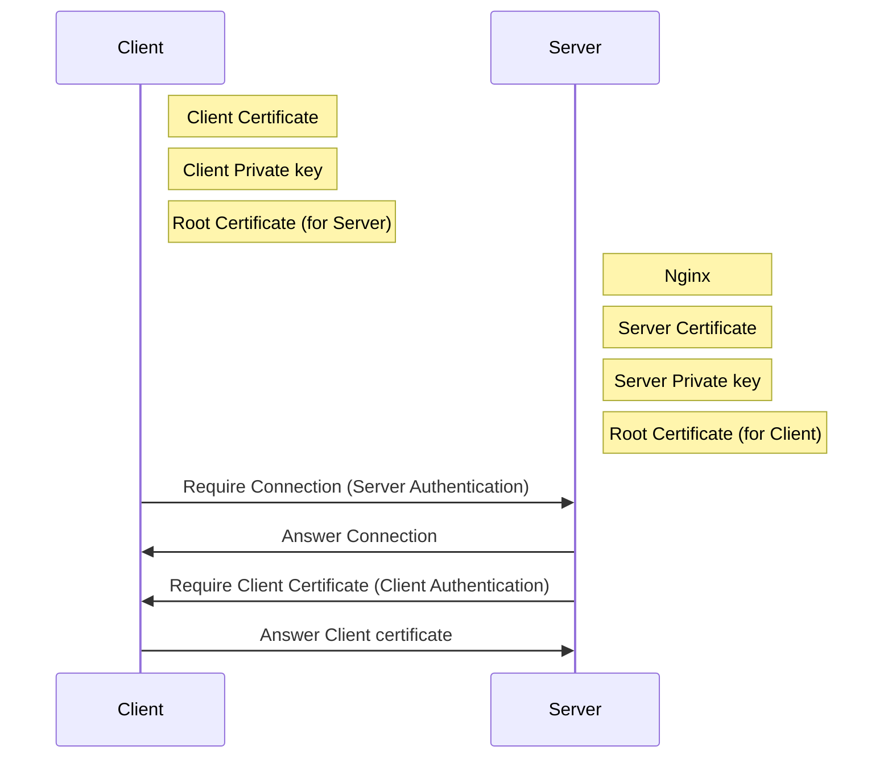

# How to configure client authentication using a certificate

## Composition

A communication diagram is below.  
Note: CA certificate may be the same for Server and Client.


## Create client certificate

- Create directory

```zsh
# mkdir /etc/pki/nginx
# cd /etc/pki/nginx
```

- Create private key for CA  

`# openssl genrsa -out ca.key 4096`

- Create CA Certificate for root CA

```zsh
# openssl req -new -x509 -days 365 -key ca.key -out ca.crt
Country Name (2 letter code) [XX]: Country
State or Province Name (full name) []: Prefecture
Locality Name (eg, city) [Default City]: City
Organization Name (eg, company) [Default Company Ltd]: Company
Organizational Unit Name (eg, section) []:IT division
Common Name (eg, your name or your server's hostname) []:test.local
Email Address []:
```

- Create private key for client certificate  

`# openssl genrsa -out client.key 4096`

- Create CSR for client certificate
Note: "Organization Name" should be different from CA.

`# openssl req -new -key client.key -out client.csr`

```zsh
Country Name (2 letter code) [XX]:JP
State or Province Name (full name) []:Hyogo
Locality Name (eg, city) [Default City]:Himeji
Organization Name (eg, company) [Default Company Ltd]:Client
Organizational Unit Name (eg, section) []:Client
Common Name (eg, your name or your server's hostname) []:
Email Address []:
A challenge password []:
An optional company name []:
```

- Create client certificate  

```zsh
# openssl x509 -req -days 365 -in client.csr -CA ca.crt -CAkey ca.key -set_serial 01 -out client.crt
Signature ok
subject=/C=JP/ST=Hyogo/L=Himeji/O=Client /OU=Client
Getting CA Private Key
```

- Convert client certificate for windows  
Note: Empty password is ok. if you configure password, require password when certificate installed.
  
```zsh
# openssl pkcs12 -export -out client.pfx -inkey client.key -in client.crt -certfile ca.crt
Enter Export Password:
Verifying - Enter Export Password:
```

## Create server certificate

- Create private key for server

`# openssl genrsa -out server.key 4096`

- Create CSR for server

```zsh
# openssl req -new -key server.key > server.csr

Country Name (2 letter code) [XX]: Country
State or Province Name (full name) []: Prefecture
Locality Name (eg, city) [Default City]: City
Organization Name (eg, company) [Default Company Ltd]: Company
Organizational Unit Name (eg, section) []: IT section
Common Name (eg, your name or your server's hostname) []: test.local
Email Address []:
A challenge password []:
An optional company name []:
```

- Create server certificate

```zsh  
# openssl x509 -days 3650 -req -signkey server.key < server.csr > server.crt
Signature ok
subject=/C=JP/ST=Hyogo/L=Himeji/O=Default Company Ltd
Getting Private key
```

- Place file for windows
- download etc/pki/nginx/client.pfx
- run client.pfx
- certificate import wizard
  - save place：current user
  - file name：default
  - password： if you need
  - Based on the type of certificate  
	(client certificate is deployed person, ca certificate is deployed Trusted Certifying Authority）

## Configure nginx

- Place certificate file on server

```zsh
# cp -p server.{crt,key} /etc/pki/nginx/
# cp -p ca.crt  /etc/pki/nginx/
# ls -1 /etc/pki/nginx
ca.crt
server.crt
server.key
```

- configure config

```zsh
# cd /etc/nginx
# cp -p nginx.conf nginx.conf.org
# vi nginx.conf
    server {
        listen       443 ssl http2 default_server;
        server_name  _;
        ssl_certificate "/etc/pki/nginx/server.crt";
        ssl_certificate_key "/etc/pki/nginx/server.key";
        ssl_verify_client on;
        ssl_client_certificate "/etc/pki/nginx/ca.crt";
        }
```

- Access Check using browser
Note: if you open the browser, close it.

access to below URL using browser.  
if when the authentication screen appears, select and press client certificate.  
https://x.x.x.x/

- Access Check using curl

```zsh 
# curl -k --cert ./client.crt --key ./client.key https://localhost/
```

## In case of change the authentication in different directories

In case of below, User having client certificate(aaa.test.local) is allowed https://localhost/auth01/.  
And user having client certificate(bbb.test.local) is allowed https://localhost/auth02/.

```zsh
# vi nginx.conf
    server {
        listen       443 ssl http2 default_server;
        server_name  _;
        ssl_certificate "/etc/pki/nginx/server.crt";
        ssl_certificate_key "/etc/pki/nginx/server.key";
        ssl_verify_client on;
        ssl_client_certificate "/etc/pki/nginx/ca.crt";
        }
		location /auth01/ {
			if ($ssl_client_verify != SUCCESS) {
				return 403;
			}
			if ($ssl_client_s_dn !~ "CN=aaa.test.local") {
				return 403;
			}
		location /auth02/	
			if ($ssl_client_verify != SUCCESS) {
				return 403;
			}
			if ($ssl_client_s_dn !~ "CN=bbb.test.local") {
				return 403;
			}			
		}
```

see also variables for ssl.  
- [Embedded Variables](http://nginx.org/en/docs/http/ngx_http_ssl_module.html)

## Reverse proxy

## See also

[OS_Kernel_parameter](./linux_kernel_parameter.md)
